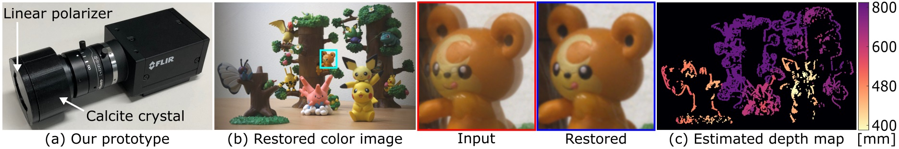

# Single-shot Monocular RGB-D Imaging using Uneven Double Refraction

This is the code release for our paper [http://vclab.kaist.ac.kr/cvpr2020p2/](http://vclab.kaist.ac.kr/cvpr2020p2/). 
In this work, we propose a method for monocular single-shot RGB-D imaging. 
Instead of learning depth from single-image depth cues, we revisit double-refraction imaging using a birefractive 
medium, measuring depth as the displacement of differently refracted images superimposed in a single capture. 
However, existing double-refraction methods are orders of magnitudes too slow to be used in real-time applications, 
e.g., in robotics, and provide only inaccurate depth due to correspondence ambiguity in double reflection. 
We resolve this ambiguity optically by leveraging the orthogonality of the two linearly polarized rays in double
refraction -- introducing uneven double refraction by adding a linear polarizer to the birefractive medium. 
Doing so makes it possible to develop a real-time method for reconstructing sparse depth and color simultaneously 
in real-time. We validate the proposed method, both synthetically and experimentally, and demonstrate 3D object 
detection and photographic applications.

## Installation
Requires *OpenCV* with *OpenCL* and *CMake*. To generate the project, run CMake:

	mkdir build && cd build
	cmake .. 

This should create the two subprojects described below and copy all required resources 
(test image and tables) to the binaries folder for the programs to run smoothly.
The project has been tested with OpenCV 4.2, NVIDIA GTX 1080 ti on Ubuntu 19.10 (g++ 9.2) and Windows 10 (VC++ 15).

## Run color and depth reconstruction demo
Run the `uneven_rgbd_demo` subproject. The program runs our algorithm on an uneven birefractive test image and displays the RGB-D results.
It uses the rectification files `resources/tform_ind1.exr`, `resources/tform_ind2.exr` and `resources/inv_ind1.exr`, `resources/inv_ind2.exr` and the test image `resources/demo.png`.
Please refer to our paper for more details on the algorithm and the class `DepthEstimator` for the implementation.

Note that `DepthEstimator::restoreImage` can be run separately for uneven superimposed images restoration.

## Build rectification tables
The subproject `precompute_rectification` shows the implementation of our dynamic-programming-based rectification for double refraction described in our paper.
This rectification enables to simplify our algorithm: our simplified model becomes compatible with computationally efficient line scans.
We obtained the birefractive baselines using Baek et al.'s model and code [https://github.com/KAIST-VCLAB/birefDepth-code](https://github.com/KAIST-VCLAB/birefDepth-code).
The baselines are given as `f*n_po2e_im.*Ro` and `f*n_pe2pd_im.*Re` in their `test_system.m` script.
The files `resources/b_e2d_1.exr`, `resources/b_e2d_2.exr` and `resources/b_o2d_1.exr`, `resources/b_o2d_2.exr` contains the precomputed birefractive baselines for our system parameters.
This subproject uses them to produce the rectification tables `resources/tform_ind_new1.exr`, `resources/tform_ind_new2.exr` and `resources/inv_ind_new1.exr`, `resources/inv_ind_new2.exr` in the build folder.
Our code detaches the depth dependency to create a depth-invariant baseline from the o-ray to the e-ray and 
generates the rectification tables to detach the baseline's spacial dependency. For more details on the model, please refer to our paper.

## Citation

	@InProceedings{Meuleman_2020_CVPR,
		author = {Andreas Meuleman and Seung-Hwan Baek and Felix Heide and Min H. Kim},
		title = {Single-shot Monocular RGB-D Imaging using Uneven Double Refraction},
		booktitle = {The IEEE Conference on Computer Vision and Pattern Recognition (CVPR)},
		month = {June},
		year = {2020}
	}
